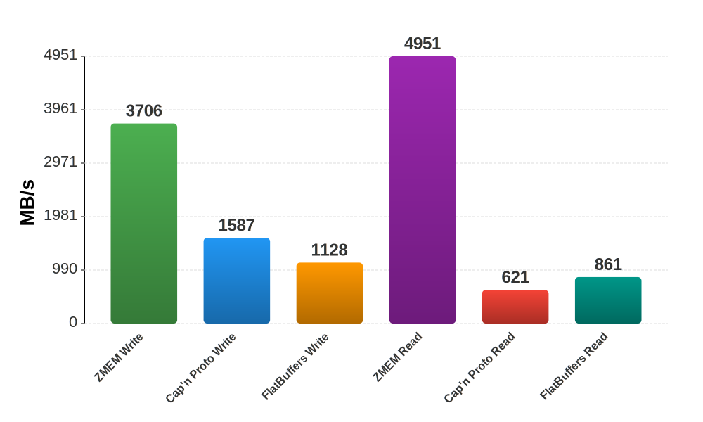
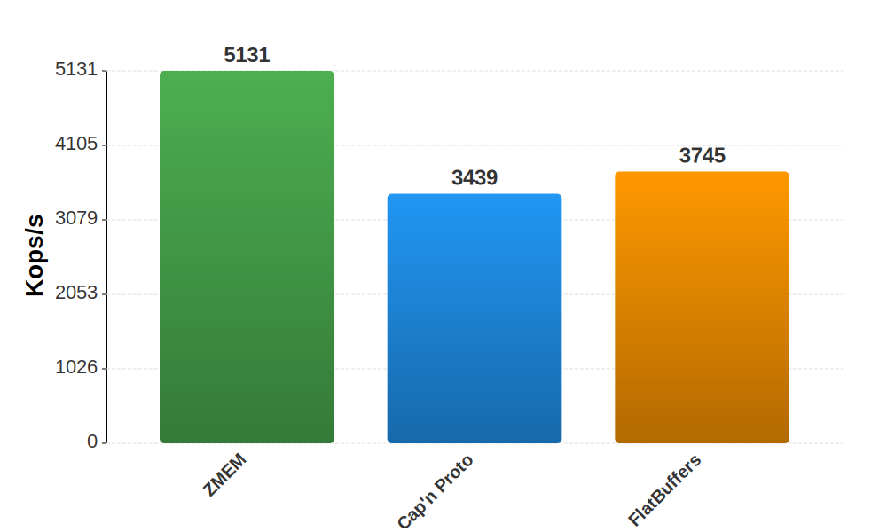

# ZMEM

A high-performance binary serialization format with **zero overhead** for fixed structs and **zero-copy** access.

## Overview

ZMEM (Zero-copy Memory Format) is designed for scenarios where serialization performance is critical: high-frequency trading, game networking, real-time systems, and inter-process communication. Unlike formats that prioritize schema evolution, ZMEM prioritizes raw speed by requiring all communicating parties use identical schemas at compile time.

### Key Features

- **Zero overhead for fixed structs** - Direct `memcpy` serialization with no headers, pointers, or metadata
- **Zero-copy deserialization** - Access data in-place without parsing or allocation
- **Native mutable state** - Fixed structs can serve as your application's data model directly
- **8-byte size alignment** - All struct sizes are padded to multiples of 8 bytes for safe zero-copy access
- **Deterministic output** - Identical data always produces identical bytes (content-addressable storage friendly)
- **Memory-mapped file support** - O(1) random access to any field in large files
- **Large data support** - 64-bit size headers support documents up to 2^64 bytes and arrays up to 2^64 elements

### Benchmark Results

#### Reading/Writing Native C++ Types

This benchmark measures serialization **from** and deserialization **to** native C++ types (structs, `std::string`, `std::vector`). This is ZMEM's primary use case.



*Throughput in MB/s (higher is better). Benchmarked using [Glaze](https://github.com/stephenberry/glaze) on Apple M1 Max.*

#### Zero-Copy Field Access

This benchmark compares zero-copy field access - reading data directly from the serialized buffer without allocating native types like `std::string` or `std::vector`:



*ZMEM and FlatBuffers achieve similar zero-copy performance (~14.5 GB/s). Cap'n Proto's accessor pattern has more overhead (2.8 GB/s).*

### Design Philosophy

ZMEM makes an explicit trade-off: **no schema evolution in exchange for maximum performance**. This is the right choice when:

- All parties are deployed together (IPC, game client/server, embedded systems)
- Performance matters more than independent versioning
- Data is transient (real-time telemetry, frame data, market data)

If you need schema evolution, consider Protocol Buffers, FlatBuffers, BEVE, or Cap'n Proto instead.

### Why ZMEM is Faster than FlatBuffers

With FlatBuffers, you define types in a `.fbs` schema file and run a code generator. For structs containing strings or vectors, you must use the builder pattern:

```cpp
// FlatBuffers: Schema file + code generation + builder pattern
flatbuffers::FlatBufferBuilder builder;
auto name = builder.CreateString("Alice");
auto scores = builder.CreateVector(std::vector<float>{95.5f, 87.0f, 91.5f});
auto player = CreatePlayer(builder, 42, name, scores);
builder.Finish(player);
```

With ZMEM, you use your existing C++ structs directly—no schema file, no code generation, no builder:

```cpp
// ZMEM: Use native C++ types directly
struct Player {
    uint64_t id;
    std::string name;
    std::vector<float> scores;
};

Player player{42, "Alice", {95.5f, 87.0f, 91.5f}};
std::string buffer;
glz::write_zmem(player, buffer);  // That's it
```

| | FlatBuffers | ZMEM |
|--|-------------|------|
| Schema definition | `.fbs` file required | Use C++ structs directly |
| Code generation | Required (`flatc`) | None (uses reflection) |
| Serialization API | Builder pattern | Single function call |
| `std::string` / `std::vector` | Supported (via builder) | Supported (native) |
| Schema evolution | Yes | No |

ZMEM's simpler serialization path—no builder objects, no intermediate allocations, no vtable construction—is why it achieves ~3x higher write throughput than FlatBuffers.

## Quick Example

### Schema Definition

```
version 1.0.0

namespace game

struct Vec3 {
  x::f32
  y::f32
  z::f32
}

struct Player {
  id::u64
  name::str[64]
  position::Vec3
  health::f32 = 100.0
  inventory::[u32]
}
```

### Wire Format Comparison

| Structure | ZMEM | Cap'n Proto | FlatBuffers |
|-----------|------|-------------|-------------|
| `Point { x, y: f32 }` | **8 bytes** | 24 bytes | 20 bytes |
| `Vec3 { x, y, z: f32 }` | **12 bytes** | 24 bytes | 20 bytes |
| Empty struct | **0 bytes** | 16 bytes | 4 bytes |

For fixed structs, ZMEM has literally zero overhead—the wire format is identical to the in-memory representation.

## Type System

### Primitives

| Type | Size | Description |
|------|------|-------------|
| `bool` | 1 byte | Boolean value |
| `i8`, `i16`, `i32`, `i64`, `i128` | 1-16 bytes | Signed integers |
| `u8`, `u16`, `u32`, `u64`, `u128` | 1-16 bytes | Unsigned integers |
| `f16`, `f32`, `f64` | 2-8 bytes | IEEE 754 floats |
| `bf16` | 2 bytes | Brain float (ML applications) |

### Compound Types

| Syntax | Description | Example |
|--------|-------------|---------|
| `str[N]` | Fixed-size string (N bytes, null-terminated) | `str[64]` |
| `string` | Variable-length string | `string` |
| `T[N]` | Fixed array | `f32[4]`, `Vec3[3]` |
| `[T]` | Vector (variable length) | `[f32]`, `[Player]` |
| `opt<T>` | Optional value | `opt<u64>` |
| `map<K,V>` | Sorted key-value pairs | `map<u32, str[64]>` |
| `enum Name : T` | Enumeration | `enum Status : u8 { ... }` |
| `union Name : T` | Tagged union | `union Result : u32 { ... }` |

### Type Aliases and Constants

```
const MAX_NAME::u32 = 64
const ORIGIN::f32[3] = [0.0, 0.0, 0.0]

type PlayerId = u64
type Name = str[MAX_NAME]
type Color = u8[4]
```

## Fixed vs Variable Types

ZMEM categorizes types into two categories:

### Fixed Types (Zero Overhead)

Fixed types are trivially copyable and serialize with a direct `memcpy`. Struct sizes are padded to multiples of 8 bytes:

```cpp
struct Particle {
    uint64_t id;
    float position[3];
    float velocity[3];
    float mass;
};
// sizeof(Particle) == 36 bytes
// Wire size: 40 bytes (padded to multiple of 8)
// Serialization: memcpy + 4 bytes padding
```

### Variable Types (Minimal Overhead)

Structs containing vectors or variable-length strings use an 8-byte size header plus 16-byte references for each variable field:

```
┌──────────────────────────────────────────────────────────────┐
│ [Size: 8 bytes] [Inline Section] [Variable Data Section]     │
└──────────────────────────────────────────────────────────────┘
```

All struct sizes (fixed and variable) are padded to multiples of 8 bytes, and variable section data is 8-byte aligned, enabling safe zero-copy access via `reinterpret_cast`.

## When to Use ZMEM

| Use Case | ZMEM | Alternatives |
|----------|------|--------------|
| IPC / Shared memory | Ideal | - |
| Game networking | Ideal | - |
| High-frequency trading | Ideal | SBE |
| Real-time telemetry | Ideal | - |
| Memory-mapped files | Ideal | - |
| Microservices (independent deployment) | Not suitable | Protobuf, BEVE |
| Long-term storage with evolution | Not suitable | BEVE, Avro |
| Browser/server communication | Not suitable | JSON, BEVE, Protobuf |

## Documentation

- [ZMEM Basics](docs/ZMEM_BASICS.md) - Beginner-friendly introduction
- [ZMEM Format Specification](docs/ZMEM_FORMAT.md) - Complete format specification
- [ZMEM Comparisons](docs/ZMEM_COMPARISONS.md) - Quick comparison with other formats
- [ZMEM vs Cap'n Proto](docs/ZMEM_VS_CAPNPROTO.md) - Detailed technical comparison
- [ZMEM vs FlatBuffers](docs/ZMEM_VS_FLATBUFFERS.md) - Detailed technical comparison

## Performance Characteristics

| Operation | ZMEM (Fixed) | ZMEM (Variable) | Cap'n Proto | FlatBuffers |
|-----------|--------------|-----------------|-------------|-------------|
| Serialize small struct | `memcpy` | Single pass | Arena + setup | Builder + copy |
| Deserialize | Cast or `memcpy` | Wrap buffer | Wrap buffer | Wrap buffer |
| Field access | Compile-time offset | Compile-time offset | Pointer chase | vtable lookup |
| Random access (mmap) | O(1) direct | O(1) with offset | O(1) with pointer | O(1) with vtable |

## Building Benchmarks

The benchmarks use [Glaze](https://github.com/stephenberry/glaze) as the ZMEM implementation.

```bash
cmake -B build -DCMAKE_BUILD_TYPE=Release
cmake --build build --config Release
./build/zmem_bench
```

## License

[MIT License](LICENSE)
